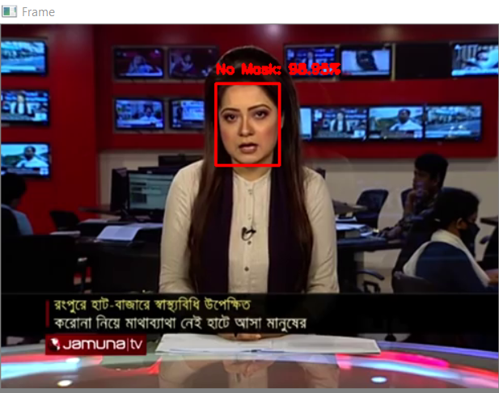
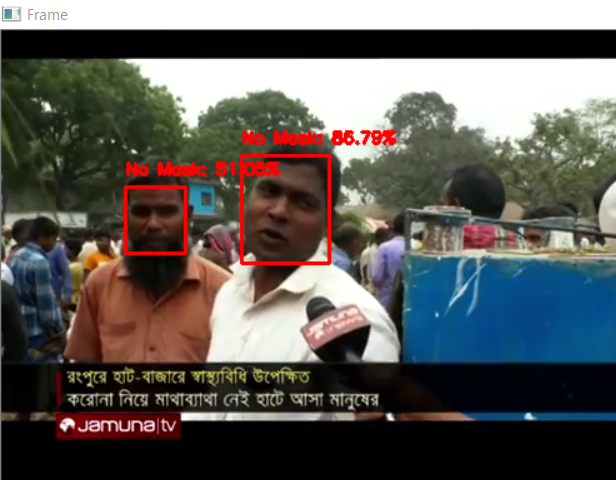
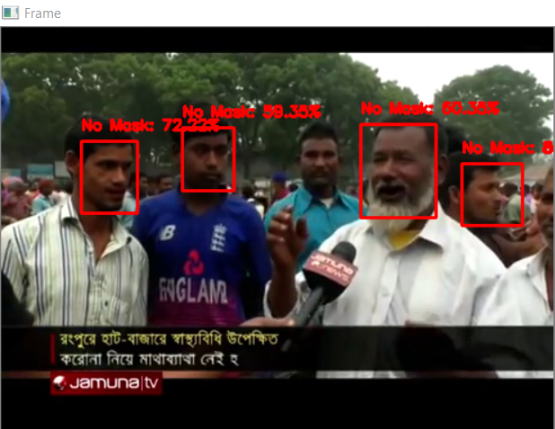

# Real-time-Face-Mask-Detection


## Used Technology
* Tensorflow
* Keras
* Open CV2 


## Getting Started

### Dependencies

* [requirement.txt](https://github.com/iqbalsublime/Real-time-Face-Mask-Detection/blob/main/requirements.txt)
* [Dataset](https://github.com/balajisrinivas/Face-Mask-Detection)

### Executing program

#### Train 

```
$python train_my_model.py
```

#### Run and Detect on local video

```
$python my_model_local_video.py
```

## Demo 
<p float="left">
  
   
  
  
</p>


## Help


## Acknowledgments

* https://github.com/balajisrinivas/Face-Mask-Detection
