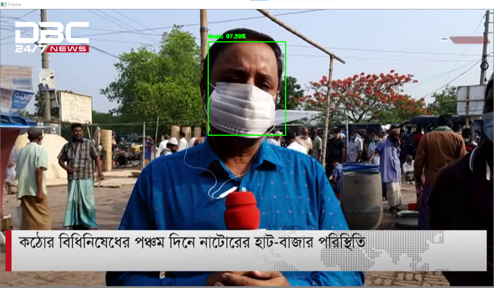

# Real-time-Face-Mask-Detection


Simple overview of use/purpose.

## Used Technology
* Tensorflow
* Keras
* Open CV2 


## Getting Started

### Dependencies

* requirement.txt [please check this] 

### Executing program

#### Train 

```
$python train_my_model.py
```

#### Run and Detect on local video

```
$python my_model_local_video.py
```

## Demo 

**1**

**2**

**3**

**4**


## Help


## Acknowledgments

* https://github.com/balajisrinivas/Face-Mask-Detection
